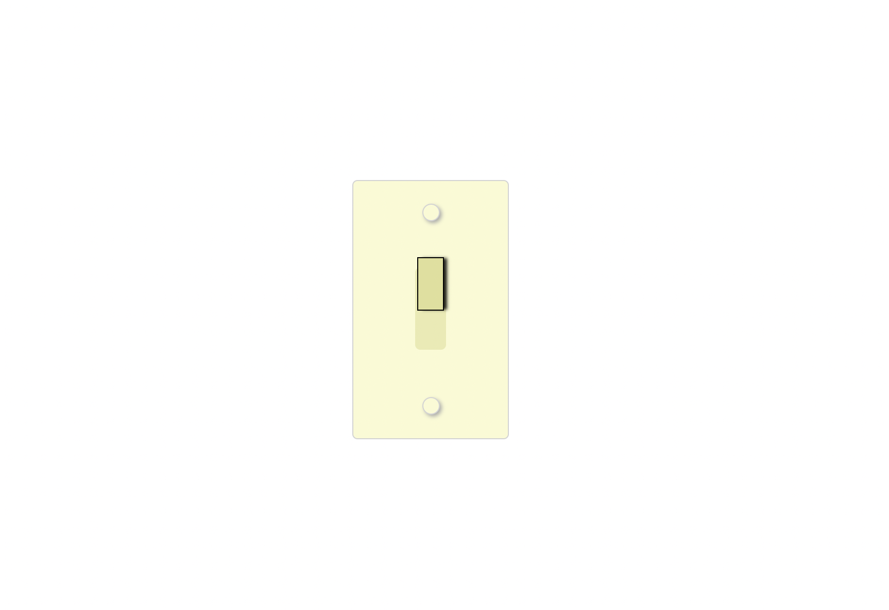

# light-switch-ReactJS
Light switch app built with ReactJS able to toggle on and off light switch. 

### Screenshot

### Links

- Live Site URL: [CodeSandbox](https://codesandbox.io/s/l2-soft-challenge-light-switch-stateful-component-nxc26?file=/src/App.js)

### Built with

- Semantic HTML5 markup
- CSS 
- JavaScript 
- ES6
- JSX
- [React](https://reactjs.org/) - JS library
